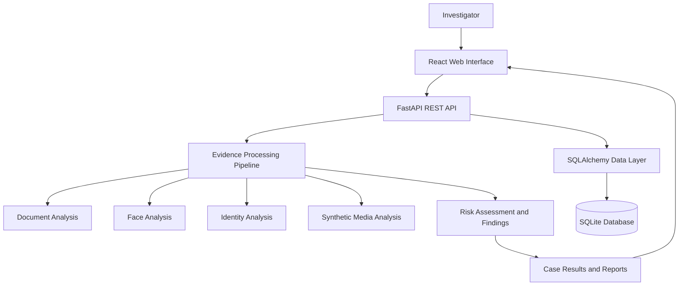

# SENTINEL-ID
### AI-Powered Multimodal Digital Identity & Synthetic Media Security System

**SENTINEL-ID** is a security-focused application designed to support the analysis of digital identity evidence through document inspection, identity-related analysis, synthetic-media analysis, and structured risk assessment.

The platform combines a web-based investigation interface with a Python backend, a modular analysis pipeline, and a case-management system to organize digital evidence and present analysis findings in a centralized environment.

Built with React, FastAPI, and Python, SENTINEL-ID brings evidence intake, cryptographic file fingerprinting, investigation records, and analysis workflows into a unified application.

---

## Overview

Digital evidence can be difficult to inspect consistently when files, investigation records, and analysis results are scattered across different tools. SENTINEL-ID provides a centralized environment for organizing evidence and reviewing the results of automated analysis.

The system is structured around four core areas:

- **Evidence Management** — Upload and associate digital evidence with investigation cases.
- **Document Intelligence** — Collect document metadata and perform supported document-level checks.
- **Identity Analysis** — Provide a modular foundation for identity-related evidence analysis.
- **Synthetic Media Security** — Organize synthetic-media analysis within the broader investigation workflow.

Analysis findings and risk indicators are presented through a command-center interface intended to make investigation records easier to navigate and review.

## Key Capabilities

### Digital Evidence Management
- Evidence upload and file handling through the backend API.
- Investigation case registration and retrieval.
- Case-specific evidence and analysis records.
- Structured findings for individual investigations.
- PDF investigation report generation.

### Document Intelligence
- File type and image metadata inspection.
- Image dimension and readability checks where applicable.
- SHA-256 file fingerprint generation.
- Structured reporting of available evidence metadata.
- A modular framework for incorporating additional document-forensics checks.

### Multimodal Analysis Architecture
- Separate analysis modules for document, face, identity, and synthetic-media workflows.
- A unified pipeline for processing evidence and collecting findings.
- Risk-level and risk-score fields for presenting analysis outcomes.
- An inconclusive result category for cases where the available checks do not justify a stronger conclusion.

### Investigation Command Center
- Dark, security-oriented dashboard design.
- Centralized case overview and case registry.
- Evidence upload interface.
- Investigation timeline and system status panels.
- Case-level access to recorded analysis results.

### Backend and Data Management
- FastAPI-based REST API.
- SQLAlchemy ORM and SQLite database integration.
- Persistent case records within the configured database environment.
- CORS configuration for local development and a separately hosted frontend.
- Interactive API documentation through Swagger UI.

---

## System Architecture

SENTINEL-ID follows a modular client-server architecture.



### Architecture Components

| Component | Responsibility |
|---|---|
| React frontend | Investigation interface and evidence workflows |
| FastAPI backend | HTTP endpoints and application logic |
| Analysis pipeline | Coordinates supported evidence checks |
| Analysis modules | Organize modality-specific processing |
| SQLAlchemy | Database interaction and ORM |
| SQLite | Local investigation and case storage |
| Report generation | Produces PDF investigation reports |

The modular structure separates the user interface, API, analysis logic, and persistence layer to support maintainability and future extension.

---

## Technology Stack

| Layer | Technologies |
|---|---|
| Frontend | React, JavaScript, Vite |
| UI and icons | CSS, Lucide React |
| Backend | Python, FastAPI, Uvicorn |
| Data validation | Pydantic |
| Database | SQLite, SQLAlchemy |
| Image processing | Pillow, OpenCV-compatible processing environment |
| File and document handling | Python file processing, pypdf |
| Report generation | ReportLab |
| Version control | Git, GitHub |

---

## Project Structure

```text
SENTINEL-ID/
├── backend/
│   ├── api/
│   │   └── routes.py
│   ├── core/
│   │   └── pipeline.py
│   ├── db/
│   │   ├── database.py
│   │   └── models.py
│   ├── modules/
│   │   ├── document_analysis/
│   │   ├── face_analysis/
│   │   ├── identity_analysis/
│   │   └── synthetic_media/
│   ├── schemas/
│   └── main.py
├── frontend/
│   ├── src/
│   │   ├── components/
│   │   ├── App.jsx
│   │   ├── App.css
│   │   └── index.css
│   ├── .env.example
│   ├── package.json
│   └── vite.config.js
├── requirements.txt
├── render.yaml
├── .gitignore
└── README.md
```

---

## Getting Started

### Prerequisites

Install the following before running the application:

- Python 3.11 or later, with compatible dependencies.
- Node.js and npm.
- Git.

### 1. Clone the repository

```bash
git clone https://github.com/sambhaviitiwari/SENTINEL-ID.git
cd SENTINEL-ID
```

### 2. Set up the backend

Create and activate a Python virtual environment.

**Windows Command Prompt:**

```cmd
python -m venv .venv
.venv\Scripts\activate
```

Install the backend dependencies:

```cmd
python -m pip install --upgrade pip
pip install -r requirements.txt
```

Start the API server from the repository root:

```cmd
python -m uvicorn backend.main:app --reload --port 8001
```

The backend will be available at:

- API root: `http://127.0.0.1:8001/`
- Health check: `http://127.0.0.1:8001/health`
- Interactive API documentation: `http://127.0.0.1:8001/docs`

### 3. Set up the frontend

Open a second terminal in the repository root:

```cmd
cd frontend
npm install
```

Create a local environment file by copying the example:

```cmd
copy .env.example .env.local
```

The local configuration should contain:

```dotenv
VITE_API_BASE_URL=http://127.0.0.1:8001
```

Start the frontend development server:

```cmd
npm run dev
```

Open the local URL displayed by Vite, normally:

`http://localhost:5173`

Keep both the backend and frontend terminals running while using the local application.

### 4. Build the frontend

To create a production build:

```cmd
npm run build
```

Vite generates the optimized frontend assets in `frontend/dist/`.

---

## API Reference

The backend exposes REST endpoints for system checks, evidence analysis, and investigation records.

| Method | Endpoint | Purpose |
|---|---|---|
| GET | `/` | Application information |
| GET | `/health` | Backend health check |
| GET | `/status` | System status, where exposed by the API router |
| POST | `/api/v1/analyze` | Submit evidence for analysis |
| GET | `/api/v1/cases` | Retrieve registered cases |
| GET | `/api/v1/cases/{case_id}` | Retrieve a case by its identifier |

The analysis endpoint accepts evidence through the configured request schema and multipart file-upload workflow. Response details depend on the analysis performed and the evidence supplied.

Use the interactive Swagger UI at `/docs` to inspect the actual request schemas, response formats, and available operations.

---

## Configuration and Deployment

### Frontend API Configuration

The frontend reads its backend URL from the `VITE_API_BASE_URL` environment variable.

For local development:

```dotenv
VITE_API_BASE_URL=http://127.0.0.1:8001
```

For a separately hosted backend, configure the variable with the backend's public HTTPS URL.

Environment variables prefixed with `VITE_` are exposed to the frontend bundle. Do not place API secrets, database credentials, or private keys in these variables.

### Backend CORS Configuration

The backend allows the local Vite development origins and supports an additional frontend origin through `FRONTEND_ORIGIN`.

For a hosted deployment, configure `FRONTEND_ORIGIN` to the exact origin of the deployed frontend.

### Hosting

The repository includes a Render Blueprint configuration in `render.yaml` for deploying the FastAPI service. The frontend can be deployed separately to a static hosting platform that supports Vite applications.

For a hosted deployment, configure the backend URL, CORS origin, database persistence, and upload-storage strategy for the target environment before relying on it for ongoing investigations.

---

## Security and Responsible Use

SENTINEL-ID is intended to support digital evidence review and investigation workflows. Automated findings should be interpreted as analytical indicators rather than definitive proof of identity, authenticity, fraud, or manipulation.

- **File integrity:** A SHA-256 hash provides a fingerprint for comparing file contents. It does not establish that a document is genuine or that its contents are truthful.
- **Risk assessment:** A risk score is an indicator generated by the configured analysis workflow, not a calibrated probability of fraud unless independently validated.
- **Inconclusive findings:** Insufficient or ambiguous evidence should not be interpreted as proof of authenticity or manipulation.
- **Privacy:** Use synthetic or non-sensitive sample files for demonstrations. Do not submit real identity documents or confidential investigation material to a public deployment without appropriate access controls and data-protection safeguards.
- **Deployment security:** Production use requires appropriate authentication, authorization, upload validation, rate limiting, secure storage, logging controls, and retention policies.
- **Model validation:** Any automated detection capability should be evaluated against representative datasets, documented metrics, and known limitations before being used for consequential decisions.

The platform should be treated as an investigation-support tool, not as a replacement for expert forensic examination or independent verification.

---

## Engineering Principles

SENTINEL-ID is organized around the following design principles:

- **Modularity:** Keep the interface, API, analysis modules, and persistence layer logically separated.
- **Traceability:** Associate analysis findings with identifiable investigation records.
- **Integrity awareness:** Use cryptographic fingerprints to help identify file-content changes.
- **Explainability:** Present findings and uncertainty rather than relying exclusively on a single score.
- **Extensibility:** Provide a structure for integrating additional forensic checks and analysis techniques.
- **Responsible automation:** Keep automated outputs subject to interpretation and independent verification.

---

## Future Extensions

The architecture can be extended with capabilities such as:

- Stronger document-tampering and metadata-consistency analysis.
- Validated facial comparison and synthetic-media detection models.
- Calibrated risk scoring and explainable findings.
- PostgreSQL-backed persistence and managed object storage.
- Role-based access control and authenticated investigations.
- Automated testing, monitoring, and deployment pipelines.
- Benchmark datasets and documented evaluation metrics.

---

## Contributing

Contributions that improve the architecture, reliability, documentation, usability, testing, or analytical methods are welcome.

1. Fork the repository.
2. Create a feature branch.
3. Make a focused change.
4. Test the affected functionality.
5. Submit a pull request describing the change and its validation.

Please do not include private identity documents, sensitive investigation records, API credentials, or other confidential material in issues, pull requests, test fixtures, or commits.

---

## License

No license is specified here. Check the repository's license file before reusing, modifying, or distributing this project.

---

## Author

**Sambhavi Tiwari**

GitHub: [@sambhaviitiwari](https://github.com/sambhaviitiwari)

LinkedIn: [linkedin.com/in/sambhavitiwari](https://www.linkedin.com/in/sambhavitiwari/)

---

*SENTINEL-ID — A modular approach to digital identity security and evidence analysis.*